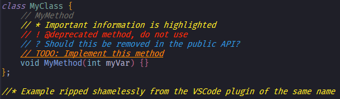
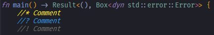
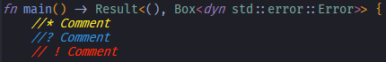

# Better Comments - NVIM
Better comments helps you to organize your comments with highlights and virtual text.
> All credits to the original author


## Example

> Additionally, the space between the comment delimiter and the tag is not necessary; `//TODO`, `//!`, `//?`, etc. are valid, as seen on the last line. See [quirks](#quirks) for more info on this style

## Installation
### Dependencies
In order to use this plugin you need to set up [Tree-sitter](https://github.com/nvim-treesitter/nvim-treesitter)

### Packer:
```lua
use "Sargates/better-comments.nvim"
```
> I don't use packer, this is taken verbatim from the forked repo

### Lazy
```lua
return {
    "Sargates/better-comments.nvim",
    opts = {}                            -- See "How to overwrite defaults" for what to put here
    -- OR
    config = function()
      require("better-comments").setup{} -- See above comment
    end
}
```

## Configuration
### Default Config
```lua
{
    tags = {
        { name = "TODO",      -- Case-sensitive name for tag
          fg = "#ff8c00",     -- Foreground (text-color) of comment color
          bg = "none",        -- Background (highlight) of comment color
          bold = false,       -- Whether to bold comment or not
          underline = true }, -- Whether to underline comment or not

        { name = "!",         -- The fields `bg`, `bold`, and `underline` have 
          fg = "#ff2d00" },   -- defaults, so they don't need to be manually specified

        { name = "?",
          fg = "#3498db" },

        { name = "*",
          fg = "#FFED29" },

        { name = "//",        -- Optional coloring for double-commenting
          fg = "#474747" },   -- change depending on your color scheme

        { name = "WARN",      -- also matches "WARNING"
          fg = "#FFA500" }
    },
    queries = {
        -- Rust's tree-sitter parser doesn't use the `comment` node, so we 
        -- need to set the selector with something that will be found
        ["rust"] = "(line_comment) @all",
        ["default"] = "(comment) @all"
    }
}
```

### How to overwrite defaults or adding new tags
```lua
require('better-comments').setup({
    tags = { --[[ Paste default config here and edit ]] }
})
```
```lua
require('better-comments').setup({
    tags = {} -- DO NOT SET THIS TO AN EMPTY TABLE. 
              -- This will cause every tag to get overwritten
})
```

## Quirks
There are a few quirks with this plugin, but nothing that prevents it from working completely (atleast that I know of).
For example, sometimes highlighting is finicky depending on the language. With Rust, the Tree-sitter parser uses the `line_comment` node instead of the `comment` node. This causes weird behavior when not separating comment delimiter and the tag identifier with a space, but only for the `!` tag.

Both of these screenshots were taken right after opening this file. \
The `!`-prefixed comment is not highlighted if there is no space between the tag and the comment delimiter: \
 \



## Contributing
Pull requests are welcome. For major changes, please open an issue first to discuss what you would like to change.
Please make sure to update tests as appropriate.

## License
[MIT](https://opensource.org/license/mit)
